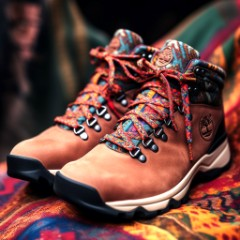
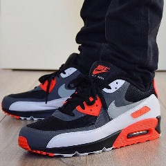

# Shoes Dataset: Real and AI-Generated Images

Midjourney                  |           Real
:-------------------------:|:-------------------------:
  |  


## Overview
This repository contains a dataset comprising both real and AI-generated images. The dataset is intended for research purposes in computer vision, machine learning, and related areas. It provides a diverse collection of images to facilitate developing and evaluating of algorithms, models, and techniques. I created this dataset from 3 separate Kaggle datasets (see references below) to use as a data source for training CNNs to predict AI-generated vs Real images of the same subject: SHOES.  

## Contents
The dataset includes two main categories of images:
1. **Real Images**: Images scraped from Google Images for Nike, Adidas, and Converse shoes. The source Kaggle dataset is linked below under references.
2. **AI-Generated Images**: Images generated using MidJourney. The source Kaggle dataset is linked below under references.

All images are of dimension 240x240. The AI-generated images have been compressed and resized to the same dimensions as the Real Images. For full-resolution AI images, refer to the source dataset below under References  

## Usage
Researchers/Developers can utilize this dataset for the following purposes:
- Training and evaluating image generation models.
- Investigating the differences between real and AI-generated images.
- Image classification, object detection, and image enhancement algorithms.
- Exploring the challenges and opportunities in the synthesis of realistic images.

## Citation
If you use this dataset in your research or projects, please consider citing this repository:

```
@misc{sunkakar,
title={Shoes Dataset: Real and AI-Generated Images},
author={Sundeep Kakar},
year={2024},
publisher={GitHub},
howpublished={\url{https://github.com/sunkakar/dataset-shoes-ai-generated}},
}
```

## Acknowledgements
I acknowledge the contributors and sources of the real images used in this dataset. Additionally, we appreciate the efforts of researchers and developers who have created the AI-generated images. Their work has been instrumental in curating this dataset.

## References
- Dataset Inspired by: [CIFAKE: Real and AI-Generated Synthetic Images](https://www.kaggle.com/datasets/birdy654/cifake-real-and-ai-generated-synthetic-images)
- AI-Generated Shoes: [Midjourney Shoe Dataset Week of May 5, 2023](https://www.kaggle.com/datasets/nikbearbrown/midjourney-shoe-dataset-week-of-may-5-2023)
- Real Shoes: [Nike, Adidas, and Converse Shoes Images](https://www.kaggle.com/datasets/die9origephit/nike-adidas-and-converse-imaged)

## License
The dataset is provided under the MIT License. Please review the license terms before using the dataset for any purpose.

## Contact
If you have any questions, feedback, or questions about the dataset, please update the Issues section for the repo. I welcome forks, contributions, and suggestions to improve the dataset and its usability!
